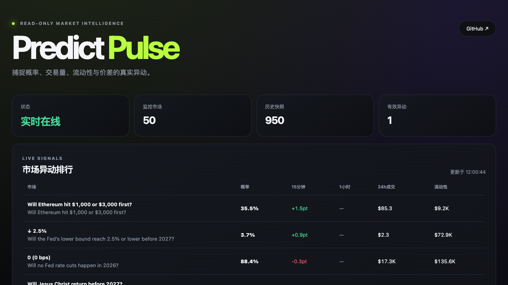

# Predict Pulse

Open-source, read-only market intelligence for [Predict](https://predict.fun).

Predict Pulse watches probability, 24-hour volume, liquidity, and spread changes; stores historical snapshots in SQLite; and sends deduplicated alerts through Bark or Telegram. It never places orders and does not require wallet access.



Live demo: http://45.32.23.55/pulse/

## What it does

1. Monitors the first 50 open Predict markets by default and derives probability from their orderbooks.
2. Detects 15-minute and 1-hour probability moves.
3. Detects unusual volume, liquidity, and spread changes.
4. Sends cooldown-protected Bark and Telegram alerts.
5. Provides a live read-only dashboard and a Codex deployment skill.

## Quick start on Ubuntu

```bash
git clone https://github.com/lionman888/predict-pulse.git
cd predict-pulse
sudo bash deploy/install.sh
```

The installer asks for the Predict API key without echoing it. For optional Bark or Telegram setup, provide `BARK_KEY`, or both `TELEGRAM_TOKEN` and `TELEGRAM_CHAT_ID`, as environment variables.

Add the Nginx location from `deploy/nginx-location.conf`, then open `/pulse/` on your server.

## Codex

Install the skill from [`skill/predict-pulse`](https://github.com/lionman888/predict-pulse/tree/main/skill/predict-pulse). In Codex, ask:

> Use $predict-pulse to deploy this on my VPS with Bark alerts.

Codex becomes the setup and operations interface; a separate UI is optional.

## Development

```bash
PYTHONPATH=. python3 -m unittest -v predict_pulse.test_pulse
```

API reference: https://dev.predict.fun/

## Operational defaults

- 60-second polling, 50 markets, and approximately 53 API requests per minute.
- The configuration validator prevents settings that would exceed 90% of the documented API rate limit.
- SQLite WAL mode, duplicate-snapshot protection, 30-day retention, and per-signal cooldowns are enabled.
- The monitor and dashboard run as a dedicated `predictpulse` system user. The dashboard uses Gunicorn and never receives the API key.
